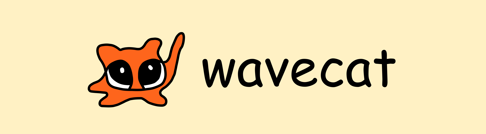

<p align="center">
  
</p>

# Wavecat Software Development Kit (SDK)
## connect your own backend :) [Work in Progress]

<p align="center">
  <a href="https://pypi.org/project/wavecat-sdk/"></a>
  <a href="https://pypi.org/project/wavecat-sdk/"></a>
  <a href="https://github.com/sdkyuanpanda/wavecat-sdk/blob/main/LICENSE"></a>
  <a href="https://github.com/sdkyuanpanda/wavecat-sdk/actions/workflows/ci.yml"></a>
  <a href="https://sdkyuanpanda.github.io/wavecat-sdk/"></a>
</p>

Run wavecat's **heavy model** on your own hardware. The SDK is a tiny, always-on
**gateway** that presents a stable OpenAI-compatible endpoint on localhost and
forwards every request to *your* model server (llama.cpp, vLLM, …). Point
wavecat at the gateway and it routes the interactive heavy work — **chat, agent,
and code** turns (plus optional screenshot Q&A) — there instead of the bundled
local 35B.

```
wavecat ──/v1──► [wavecat-sdk gateway :8800] ──/v1──► your llama.cpp / vLLM
```

> **Minimal exposure.** The gateway only ever sees OpenAI chat-completion
> payloads — prompts, tool *schemas*, tool *results as text*, sampling params.
> It never runs a wavecat tool and never touches your local data. Tools
> always execute inside wavecat; this process just generates tokens.

📖 **Full documentation:** <https://sdkyuanpanda.github.io/wavecat-sdk/>

## Why wavecat-sdk?

- **Your hardware, your model** — offload the heavy turns to a GPU box or any
  OpenAI-compatible server you already run.
- **One command, always on** — it's a CLI; `pip install`, `wavecat-sdk serve`,
  done. Nothing to wire up in code.
- **Minimal exposure** — only OpenAI chat payloads cross the gateway; it never
  runs tools or touches your data.
- **Drop-in OpenAI compatibility** — streaming SSE relayed unchanged, so wavecat
  sees the exact deltas it expects.
- **Graceful fallback** — if the gateway/upstream is unreachable, wavecat falls
  back to the local 35B, so turns never hard-fail.

---

## Install

```bash
pip install -e .          # from this repo (or `pip install wavecat-sdk` once published)
```

Requires Python ≥ 3.10. Pulls in `fastapi`, `uvicorn`, `httpx`.

## Run

First start your own OpenAI-compatible server, e.g.:

```bash
# llama.cpp
llama-server -m my-model.gguf --host 127.0.0.1 --port 8000 --jinja

# …or vLLM
vllm serve my-org/my-model --port 8000
```

Then run the gateway in front of it (keep it running — it should be always on):

```bash
wavecat-sdk serve --upstream http://127.0.0.1:8000/v1 --model my-model --port 8800
```

Flags (env equivalents in parentheses):

| Flag | Meaning |
|---|---|
| `--upstream`     | Your server's OpenAI root (`WAVECAT_SDK_UPSTREAM`). |
| `--upstream-key` | Bearer token your server needs, if any (`WAVECAT_SDK_KEY`). |
| `--model`        | Rewrite the inbound model id to this, so wavecat can send anything (`WAVECAT_SDK_MODEL`). |
| `--host`/`--port`| Where the gateway listens (`WAVECAT_SDK_HOST`/`_PORT`, default `127.0.0.1:8800`). |
| `--strip-keys`   | Comma-separated body keys to drop before forwarding (default `cache_prompt`). |

## Connect it in wavecat

In wavecat → **Settings → Backend**:

1. Toggle **Use a custom backend** on.
2. **Base URL**: `http://127.0.0.1:8800/v1`
3. **Model id**: whatever you passed to `--model` (or `default`).
4. **Vision-capable** — turn on only if your upstream is a vision model; otherwise
   screenshot questions stay on the local 35B.
5. **Test connection** to verify the chain, then **Save**.

Your backend serves the interactive work (chat, agent, code). Managing context always stays on the local model, since that requires special grammar and other protocols.

We are working improving how much processing can be offloaded to your own local model so that you can run wavecat on even less capable laptops!

If the gateway/upstream is ever unreachable, wavecat silently falls back to the
local 35B, so turns never hard-fail.

## Notes on compatibility

- **chat & code** modes use native OpenAI **tool-calling** (`tools=`), so your
  upstream must support tool calls for those. **agent** (deep-think) mode works
  on any chat-completions model.
- wavecat sends `chat_template_kwargs.enable_thinking` to toggle reasoning and
  `cache_prompt` for fresh context. The gateway drops `cache_prompt` by default;
  add `chat_template_kwargs` to `--strip-keys` if your server rejects it.

More plugins and skill add-on stuff coming soon.
